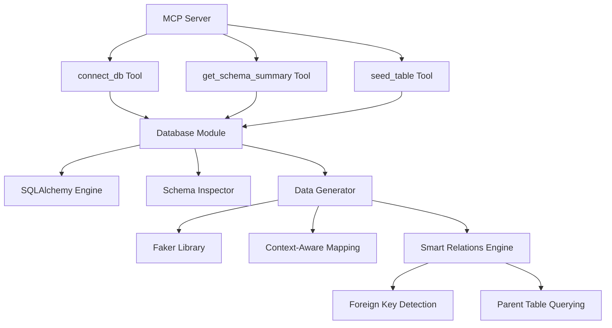

# DataForge MCP Server Architecture Plan

## Overview
DataForge is an MCP server that enables AI agents to generate realistic test data for databases while maintaining referential integrity. It supports PostgreSQL, MySQL, and SQLite.

## High-Level Architecture

## Modules

### database.py
- Database connection management
- Schema inspection using SQLAlchemy inspect
- Foreign key detection and parent table querying
- Data generation with Faker and heuristics
- Bulk insert operations

### server.py
- MCP server initialization
- Tool definitions: connect_db, get_schema_summary, seed_table
- Error handling and response formatting

### requirements.txt
- Python dependencies: mcp, sqlalchemy, faker, pydantic

### README.md
- Installation and configuration instructions
- Usage examples
- claude_desktop_config.json setup

## Key Features Implementation

### Smart Relations
- Use SQLAlchemy inspect to detect FKs
- Query parent tables for valid PKs
- Random selection for FK values
- Error if parent table empty

### Context-Aware Mapping
- Column name/type analysis
- Faker method selection
- Support for JSON, booleans, dates, etc.

### Safety & Performance
- Max 1000 rows per request
- Session scope management
- Graceful error messages

## Development Plan
1. Implement database module
2. Implement server module
3. Create configuration files
4. Test and refine